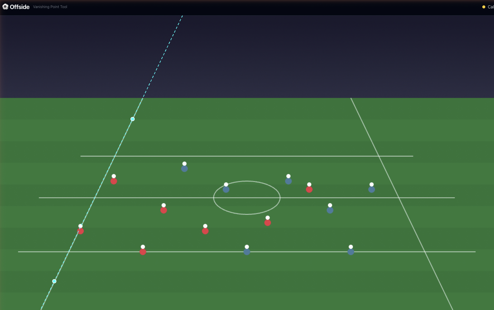
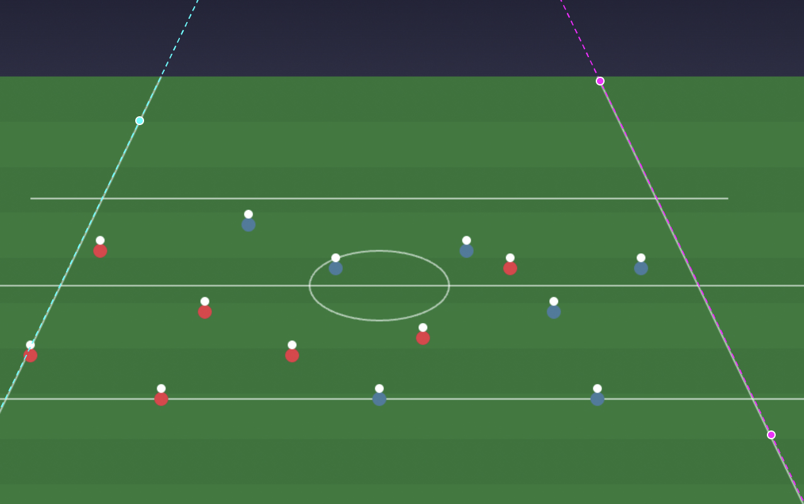
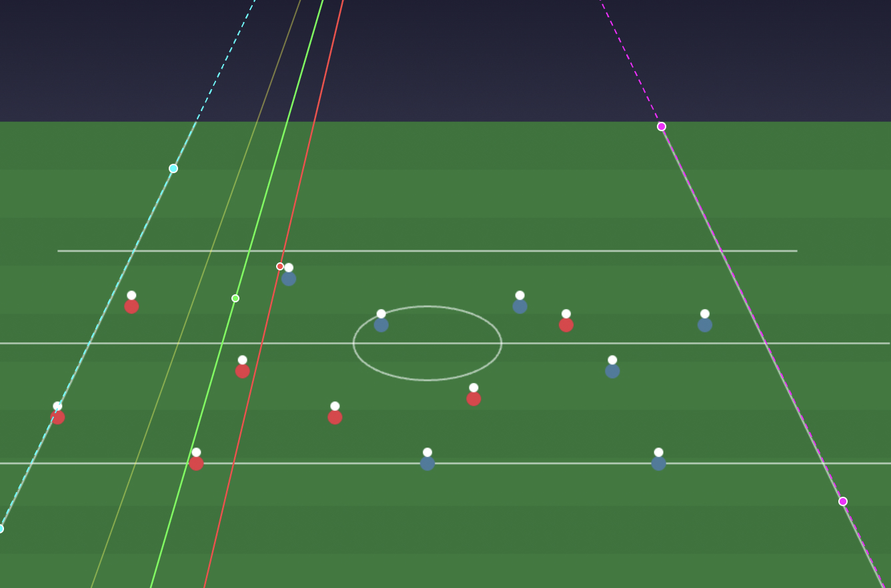

# Offside

A browser-based tool for verifying offside calls in soccer/football using vanishing point perspective geometry.

Upload a match screenshot, calibrate two converging pitch lines to find the vanishing point, then draw offside lines that follow the correct perspective of the field.

## How It Works

See it live [offside-check](https://offside-check.vercel.app/)

### Step 1 — Upload & Calibrate

Drop a match screenshot into the app, then click two points on each of two visible pitch lines (e.g. sidelines, penalty box edges). The tool traces these as cyan and magenta dashed lines and computes their intersection — the **vanishing point**.



### Step 2 — Draw Offside Lines

Once calibrated, click anywhere on the pitch to draw perspective-correct offside lines. Each line passes through the vanishing point, matching the true geometry of the field regardless of camera angle.



### Step 3 — Analyze

Add multiple color-coded lines to compare player positions. Lines can be individually deleted from the sidebar or cleared all at once.



## Getting Started

```bash
npm install
npm run dev
```

Open [http://localhost:3000](http://localhost:3000).

## Tech Stack

- **Next.js 16** (App Router)
- **React 19** + **TypeScript**
- **Tailwind CSS**
- Pure client-side — no backend or database required

### Deployment status

